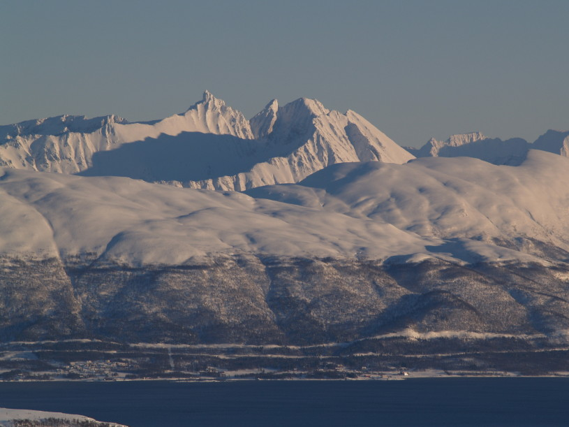

# fayirikante.github.io
## My research

Hello, my name is Fayiri, I am a Ph.D. student in Biology
at [Weizmann](https://www.weizmann.ac.il/pages/).
My group, led by [Pr.Gad Asher](https://www.weizmann.ac.il/Biomolecular_Sciences/Asher/home) studies 
- circadian clocks 
- hypoxia
- exercise physiology.

## Arctic animal as a reseacrch model

The Hooded seal is an expert diver and model to study **hypoxia** adaptations as it spends most of its life underwater

males have a red nasal sac. they inflate it to show who is the toughest.

## Go, study on the muntains!

high altitude is also en environment where *oxygen* becomes rare, and organisms are forced to adapt

this muntain is not high enough to trigger hypoxic adaptations, but it has a cool pointy peak!

